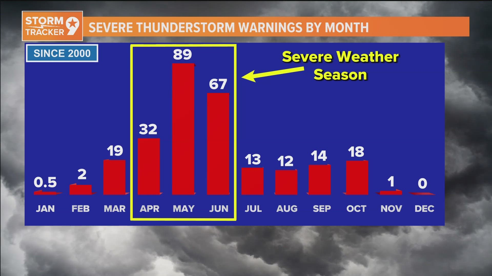
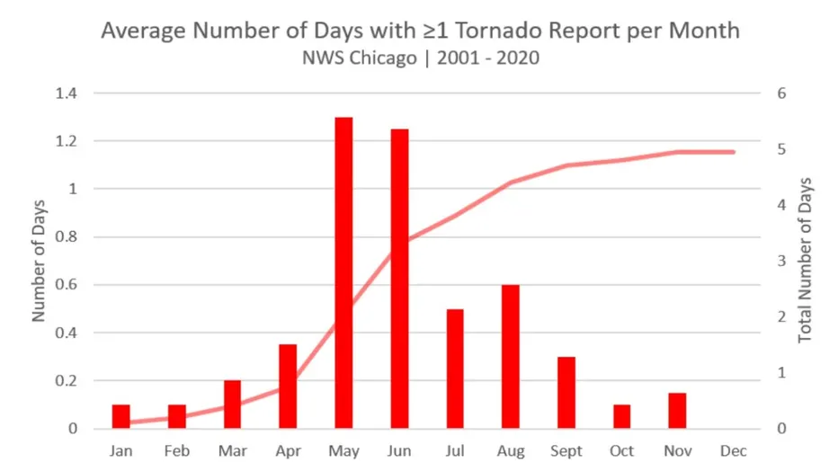
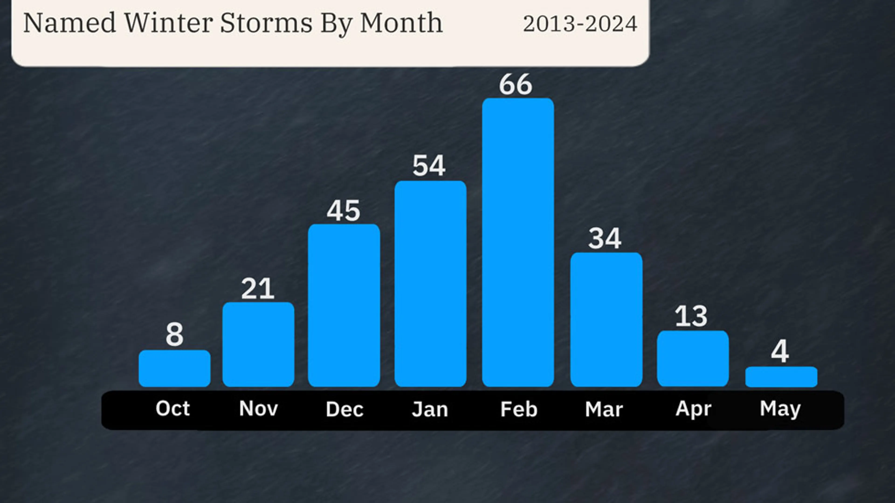

# Analyzing the Impact of Climate and Regional Information on Power Outages
Final project for DSC 80 @ UCSD by Sweekrit Bhatnagar

## Introduction

### Choice of dataset

In this project, I analyze major outage events witnessed in the continental US from January 2000 to July 2016, where a "major outage" refers to an outage that impacted at least 50,000 customers or caused a firm load loss of 300 MW. In addition to the outages' characteristics, the dataset also contains information regarding regional climate information, land-use, electricity consumption patterns, and economic characteristics. 

I chose this dataset because it yields itself to interesting analysis on variables that predict outage, especially considering the diversity and amount of geographic, climate, and economic information available. Furthermore, the dataset itself is important due to the **real world consequences** of power outages - these events have major societal impact and affect key infrastructure, including hospitals, transport systems, communication networks, etc. Working with this dataset allows us to do important data analysis on the causes of these events, and inform policymaking and mitigation strategies in order to product cities and homes from major power outages.

### Questions brainstorm and selection

While looking at the dataset, I thought of the following questions that I could analyze:
1. What is the background regional and climate information (i.e. the environment) of major power outages of varying severity and cause?
2. How do socioeconomic conditions of the region affect the severity of outages as measured by the duration and number of people affected?
3. Is there a distinct geographic association with coastal regions and power outage cause and/or severity? What background characteristics play into the distinction?

However, I ultimately chose to go with the first question: 
**What is the background regional and climate information (i.e. the environment) of major power outages of varying severity and cause?**

Specifically, I plan to look into how various features that can affect regional climate (such as the geographic region, the month the outage occurred, the presence of a hurricane, etc.) play into the impact characteristics of outages, focusing on outage duration and the cause category.

Reasons why this question is important:
1. Different climate patterns can strongly influence storm severity, equipment stress, grid load, etc. and can be key preidctors about whether an area is affected by a major power outage.
2. Climate change sees an increased variance of climate events - being able to predict power outages quickly before they happened can be important to save infrastucture in times of climate disaster (ex. hurricanes or major storms).

### Description of key columns and overall shape of dataset

There are **1534 rows** in the dataset, indicating the presence of 1534 major outage events that occurred in the time period of the study, of which we find the following features relevant:

<table>
  <thead>
    <tr>
      <th>Category</th>
      <th>Variable</th>
      <th>Description</th>
    </tr>
  </thead>
  <tbody>
    <tr><td rowspan="5">General Information</td><td>YEAR</td><td>Year when the outage event occurred</td></tr>
    <tr><td>MONTH</td><td>Month when the outage event occurred</td></tr>
    <tr><td>U.S._STATE</td><td>U.S. state where the outage occurred</td></tr>
    <tr><td>POSTAL.CODE</td><td>Postal code of the U.S. state</td></tr>
    <tr><td>NERC.REGION</td><td>NERC region involved in the outage</td></tr>
    <tr><td rowspan="3">Regional Climate Information</td><td>CLIMATE.REGION</td><td>U.S. climate region as defined by the National Centers for Environmental Information (9 regions total)</td></tr>
    <tr><td>ANOMALY.LEVEL</td><td>Oceanic Niño/La Niña index (ONI), 3-month running mean of SST anomalies</td></tr>
    <tr><td>CLIMATE.CATEGORY</td><td>Climate category (“Warm,” “Cold,” or “Normal”) based on ONI index ±0.5°C</td></tr>
    <tr><td rowspan="10">Outage Event Information</td><td>OUTAGE.START.DATE</td><td>Calendar day when the outage started</td></tr>
    <tr><td>OUTAGE.START.TIME</td><td>Time of day when the outage started</td></tr>
    <tr><td>OUTAGE.RESTORATION.DATE</td><td>Calendar day when power was fully restored</td></tr>
    <tr><td>OUTAGE.RESTORATION.TIME</td><td>Time of day when power was fully restored</td></tr>
    <tr><td>CAUSE.CATEGORY</td><td>High-level category describing the cause of the outage</td></tr>
    <tr><td>CAUSE.CATEGORY.DETAIL</td><td>Detailed description of the event cause</td></tr>
    <tr><td>HURRICANE.NAMES</td><td>Hurricane name if the outage was caused by a hurricane</td></tr>
    <tr><td>OUTAGE.DURATION</td><td>Duration of the outage in minutes</td></tr>
    <tr><td>DEMAND.LOSS.MW</td><td>Peak demand lost during the outage (megawatts)</td></tr>
    <tr><td>CUSTOMERS.AFFECTED</td><td>Number of customers impacted by the outage</td></tr>
    <tr><td rowspan="11">Regional Land-Use Characteristics</td><td>POPULATION</td><td>Population of the U.S. state in the given year</td></tr>
    <tr><td>POPPCT_URBAN</td><td>Percentage of the population living in urban areas</td></tr>
    <tr><td>POPPCT_UC</td><td>Percentage of the population living in urban clusters</td></tr>
    <tr><td>POPDEN_URBAN</td><td>Population density of urban areas (persons/sq. mile)</td></tr>
    <tr><td>POPDEN_UC</td><td>Population density of urban clusters (persons/sq. mile)</td></tr>
    <tr><td>POPDEN_RURAL</td><td>Population density of rural areas (persons/sq. mile)</td></tr>
    <tr><td>AREAPCT_URBAN</td><td>Percentage of the state’s land area classified as urban</td></tr>
    <tr><td>AREAPCT_UC</td><td>Percentage of the state’s land area classified as urban clusters</td></tr>
    <tr><td>PCT_LAND</td><td>Percentage of total U.S. land area represented by the state</td></tr>
    <tr><td>PCT_WATER_TOT</td><td>Percentage of total U.S. water area represented by the state</td></tr>
    <tr><td>PCT_WATER_INLAND</td><td>Percentage of total U.S. inland water area represented by the state</td></tr>
  </tbody>
</table>

## Data Cleaning and Exploratory Data Analysis

### Data Cleaning
I took the following steps to clean my data. Note that in this step, I DID NOT impute `NaN` values, as those will be important for future missingness analysis:
1. Set the index of the dataset using a unique identifier `OBS` instead of sticking with the default sequence. This allowed for a cleaner dataset that did not have a duplicate index variable, preventing its inclusion in exploratory data analysis (as it would just be a static range) or predictions.
2. Perform datetime conversions. There seem to be separate columns for the calendar date and the time - combining these would make future analysis easier, and converting to datetime would allow for them to become quantitative discrete variables that I can use in future analysis if I choose to. Specifically, I combine `OUTAGE.START.DATE` and `OUTAGE.START.TIME` and `OUTAGE.RESTORATION.DATE` and `OUTAGE.RESTORATION.TIME` and convert them using `pd.to_datetime()`
3. Drop any unnecessary and/or redundant columns. Although in Steps 3-8 I am already filtering for the columns that I want, this will make my data cleaner and more easily perform the univariate and bi-variate analysis of this step. The columns I drop are `OUTAGE.START.TIME`, `OUTAGE.RESTORATION.TIME`, and `U.S._STATE`. 
   - I drop `OUTAGE.START.TIME` and `OUTAGE.RESTORATION.TIME` because their data has already been included into `OUTAGE.START.DATE` and `OUTAGE.RESTORATION.DATE`
   - I drop `U.S._STATE` because it contains the same information as `POSTAL.CODE`
   - Note that although I am looking at specifically climate and regional information, I don't drop any more columns. This is because in the case that my research question changes further along in the project to account for economic factors (for example, in Step 8), I want the freedom to access these values.
4. I replace 0 values in the columns that I am using to look at my impact with `NaN`. These include `CUSTOMERS.AFFECTED` and `DEMAND.LOSS.MW`. This is because in the data specifications, we know that the amount of customers affected is at least 50,000 and the demand lost is at least 300 MW.
    - I do not replace 0 values in `OUTAGE.DURATION`. Although it is unlikely that a major outage event lasts 0 minutes there is no indication that this is a requirement for the dataset, and it is possible that power was restored immediately. 

Here is the cleaned data:
<table width='500'>
  <thead>
    <tr>
      <th>YEAR</th>
      <th>MONTH</th>
      <th>POSTAL.CODE</th>
      <th>NERC.REGION</th>
      <th>CLIMATE.REGION</th>
      <th>ANOMALY.LEVEL</th>
      <th>CLIMATE.CATEGORY</th>
      <th>OUTAGE.START.DATE</th>
      <th>OUTAGE.RESTORATION.DATE</th>
      <th>CAUSE.CATEGORY</th>
      <th>CAUSE.CATEGORY.DETAIL</th>
      <th>HURRICANE.NAMES</th>
      <th>OUTAGE.DURATION</th>
      <th>DEMAND.LOSS.MW</th>
      <th>CUSTOMERS.AFFECTED</th>
      <th>RES.PRICE</th>
      <th>COM.PRICE</th>
      <th>IND.PRICE</th>
      <th>TOTAL.PRICE</th>
      <th>RES.SALES</th>
      <th>COM.SALES</th>
      <th>IND.SALES</th>
      <th>TOTAL.SALES</th>
      <th>RES.PERCEN</th>
      <th>COM.PERCEN</th>
      <th>IND.PERCEN</th>
      <th>RES.CUSTOMERS</th>
      <th>COM.CUSTOMERS</th>
      <th>IND.CUSTOMERS</th>
      <th>TOTAL.CUSTOMERS</th>
      <th>RES.CUST.PCT</th>
      <th>COM.CUST.PCT</th>
      <th>IND.CUST.PCT</th>
      <th>PC.REALGSP.STATE</th>
      <th>PC.REALGSP.USA</th>
      <th>PC.REALGSP.REL</th>
      <th>PC.REALGSP.CHANGE</th>
      <th>UTIL.REALGSP</th>
      <th>TOTAL.REALGSP</th>
      <th>UTIL.CONTRI</th>
      <th>PI.UTIL.OFUSA</th>
      <th>POPULATION</th>
      <th>POPPCT_URBAN</th>
      <th>POPPCT_UC</th>
      <th>POPDEN_URBAN</th>
      <th>POPDEN_UC</th>
      <th>POPDEN_RURAL</th>
      <th>AREAPCT_URBAN</th>
      <th>AREAPCT_UC</th>
      <th>PCT_LAND</th>
      <th>PCT_WATER_TOT</th>
      <th>PCT_WATER_INLAND</th>
    </tr>
  </thead>
  <tbody>
    <tr>
      <td>2011</td><td>7</td><td>MN</td><td>MRO</td><td>East North Central</td><td>-0.3</td><td>normal</td>
      <td>2011-07-01 17:00:00</td><td>2011-07-03 20:00:00</td><td>severe weather</td><td>nan</td><td>nan</td>
      <td>3060</td><td>nan</td><td>70000</td><td>11.6</td><td>9.18</td><td>6.81</td><td>9.28</td>
      <td>2.33292e+06</td><td>2.11477e+06</td><td>2.11329e+06</td><td>6.56252e+06</td>
      <td>35.5491</td><td>32.225</td><td>32.2024</td><td>2308736</td><td>276286</td><td>10673</td><td>2595696</td>
      <td>88.9448</td><td>10.644</td><td>0.4112</td><td>51268</td><td>47586</td><td>1.07738</td><td>1.6</td>
      <td>4802</td><td>274182</td><td>1.75139</td><td>2.2</td><td>5348119</td><td>73.27</td><td>15.28</td><td>2279</td>
      <td>1700.5</td><td>18.2</td><td>2.14</td><td>0.6</td><td>91.5927</td><td>8.40733</td><td>5.47874</td>
    </tr>
    <tr>
      <td>2014</td><td>5</td><td>MN</td><td>MRO</td><td>East North Central</td><td>-0.1</td><td>normal</td>
      <td>2014-05-11 18:38:00</td><td>2014-05-11 18:39:00</td><td>intentional attack</td><td>vandalism</td><td>nan</td>
      <td>1</td><td>nan</td><td>nan</td><td>12.12</td><td>9.71</td><td>6.49</td><td>9.28</td>
      <td>1.58699e+06</td><td>1.80776e+06</td><td>1.88793e+06</td><td>5.28423e+06</td>
      <td>30.0325</td><td>34.2104</td><td>35.7276</td><td>2345860</td><td>284978</td><td>9898</td><td>2640737</td>
      <td>88.8335</td><td>10.7916</td><td>0.3748</td><td>53499</td><td>49091</td><td>1.08979</td><td>1.9</td>
      <td>5226</td><td>291955</td><td>1.79</td><td>2.2</td><td>5457125</td><td>73.27</td><td>15.28</td><td>2279</td>
      <td>1700.5</td><td>18.2</td><td>2.14</td><td>0.6</td><td>91.5927</td><td>8.40733</td><td>5.47874</td>
    </tr>
    <tr>
      <td>2010</td><td>10</td><td>MN</td><td>MRO</td><td>East North Central</td><td>-1.5</td><td>cold</td>
      <td>2010-10-26 20:00:00</td><td>2010-10-28 22:00:00</td><td>severe weather</td><td>heavy wind</td><td>nan</td>
      <td>3000</td><td>nan</td><td>70000</td><td>10.87</td><td>8.19</td><td>6.07</td><td>8.15</td>
      <td>1.46729e+06</td><td>1.80168e+06</td><td>1.9513e+06</td><td>5.22212e+06</td>
      <td>28.0977</td><td>34.501</td><td>37.366</td><td>2300291</td><td>276463</td><td>10150</td><td>2586905</td>
      <td>88.9206</td><td>10.687</td><td>0.3924</td><td>50447</td><td>47287</td><td>1.06683</td><td>2.7</td>
      <td>4571</td><td>267895</td><td>1.70627</td><td>2.1</td><td>5310903</td><td>73.27</td><td>15.28</td><td>2279</td>
      <td>1700.5</td><td>18.2</td><td>2.14</td><td>0.6</td><td>91.5927</td><td>8.40733</td><td>5.47874</td>
    </tr>
    <tr>
      <td>2012</td><td>6</td><td>MN</td><td>MRO</td><td>East North Central</td><td>-0.1</td><td>normal</td>
      <td>2012-06-19 04:30:00</td><td>2012-06-20 23:00:00</td><td>severe weather</td><td>thunderstorm</td><td>nan</td>
      <td>2550</td><td>nan</td><td>68200</td><td>11.79</td><td>9.25</td><td>6.71</td><td>9.19</td>
      <td>1.85152e+06</td><td>1.94117e+06</td><td>1.99303e+06</td><td>5.78706e+06</td>
      <td>31.9941</td><td>33.5433</td><td>34.4393</td><td>2317336</td><td>278466</td><td>11010</td><td>2606813</td>
      <td>88.8954</td><td>10.6822</td><td>0.4224</td><td>51598</td><td>48156</td><td>1.07148</td><td>0.6</td>
      <td>5364</td><td>277627</td><td>1.93209</td><td>2.2</td><td>5380443</td><td>73.27</td><td>15.28</td><td>2279</td>
      <td>1700.5</td><td>18.2</td><td>2.14</td><td>0.6</td><td>91.5927</td><td>8.40733</td><td>5.47874</td>
    </tr>
    <tr>
      <td>2015</td><td>7</td><td>MN</td><td>MRO</td><td>East North Central</td><td>1.2</td><td>warm</td>
      <td>2015-07-18 02:00:00</td><td>2015-07-19 07:00:00</td><td>severe weather</td><td>nan</td><td>nan</td>
      <td>1740</td><td>250</td><td>250000</td><td>13.07</td><td>10.16</td><td>7.74</td><td>10.43</td>
      <td>2.02888e+06</td><td>2.16161e+06</td><td>1.77794e+06</td><td>5.97034e+06</td>
      <td>33.9826</td><td>36.2059</td><td>29.7795</td><td>2374674</td><td>289044</td><td>9812</td><td>2673531</td>
      <td>88.8216</td><td>10.8113</td><td>0.367</td><td>54431</td><td>49844</td><td>1.09203</td><td>1.7</td>
      <td>4873</td><td>292023</td><td>1.6687</td><td>2.2</td><td>5489594</td><td>73.27</td><td>15.28</td><td>2279</td>
      <td>1700.5</td><td>18.2</td><td>2.14</td><td>0.6</td><td>91.5927</td><td>8.40733</td><td>5.47874</td>
    </tr>
  </tbody>
</table>

### Univariate analysis

#### Outage impact metrics

First, let's look at the univariate analysis of the outage impact metrics.

  <iframe src="assets/univariate_output_combined.html" 
          width="90%" 
          height="400" 
          frameborder="0"></iframe>

Analyzing these column univariate analysis, we note that all the columns have a heavy right skew, with a mean close to 0 despite maximum values moving far into the thousands (for `OUTAGE.DURATION` and `DEMAND.LOSS.MW`) or far into the millions (for `CUSTOMERS.AFFECTED`). This means two things:
1. In our bivariate analysis, it is in our best interest to remove the top 5-10% of values to remove these extreme outliers and get a better idea of any patterns that might arise in the data.
2. When making predictions, if we were to go down a regression analysis route with these impact factors, we might face high RMSE values.

#### Climate features

Next, look at the univariate analysis of three climate fatures of interest. Specifically, the `CLIMATE.REGION`, `CLIMATE.CATEGORY`, and `MONTH`.

  <iframe src="assets/univariate_climate_time_combined.html" 
          width="90%" 
          height="400" 
          frameborder="0"></iframe>

We can make the following observations with all these graphs:
1. `CLIMATE.REGION`: The Northeast region by far faces the largest amount of power outages, with over 300 of them, followed by the South and then the West. Furthermore, the West North Central and Southwest regions face the least amount of power outages. This could imply that there are sub-characteristics present that cause them to have more/less outages.
2. `CLIMATE.CATEGORY`: The most power outages occur in normal years, then cold years, and finally in warm years. However, unlike the climate region, we cannot be quick to assume that regional/climate characteristics cause this. It is more likely that the "normal" climate category encompasses a much larger portion of the years studied because the average year **is** normal.
3. `MONTH`: The summer months seem to have the largest proportion of power outages, followed closely by the late winter months. This might be due to thunderstorms and tornadoes in the summer months and winter storms in the late winter. This can be verified by looking at the following reference graphs (News West 9, Fox 32, The Weather Channel).

    
    
    

### Bivariate analysis

We can focus on the climate features of interest from our univariate analysis for our bivariate analysis. For each of these categorical columns, we produced box plots. Hello