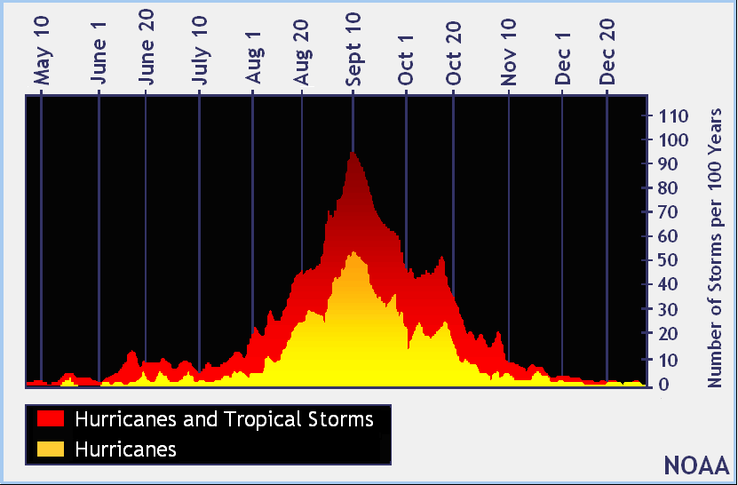
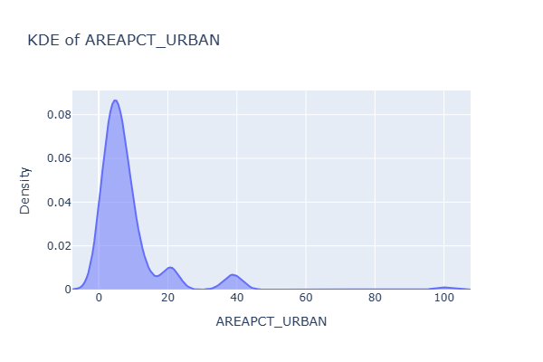
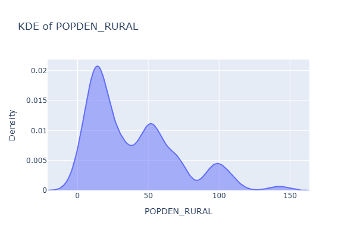

# Analyzing the Impact of Climate and Regional Information on Power Outages
Final project for DSC 80 @ UCSD by Sweekrit Bhatnagar

## Introduction

### Choice of dataset

In this project, I analyze major outage events witnessed in the continental US from January 2000 to July 2016, where a "major outage" refers to an outage that impacted at least 50,000 customers or caused a firm load loss of 300 MW. In addition to the outages' characteristics, the dataset also contains information regarding regional climate information, land-use, electricity consumption patterns, and economic characteristics. 

I chose this dataset because it yields itself to interesting analysis on variables that predict outage, especially considering the diversity and amount of geographic, climate, and economic information available. Furthermore, the dataset itself is important due to the **real world consequences** of power outages - these events have major societal impact and affect key infrastructure, including hospitals, transport systems, communication networks, etc. Working with this dataset allows us to do important data analysis on the causes of these events, and inform policymaking and mitigation strategies in order to product cities and homes from major power outages.

### Questions brainstorm and selection

While looking at the dataset, I thought of the following questions that I could analyze:
1. What is the background regional and climate information (i.e. the environment) of major power outages of varying severity and cause?
2. How do socioeconomic conditions of the region affect the severity of outages as measured by the duration and number of people affected?
3. Is there a distinct geographic association with coastal regions and power outage cause and/or severity? What background characteristics play into the distinction?

However, I ultimately chose to go with the first question: 
**What is the background regional and climate information (i.e. the environment) of major power outages of varying severity and cause?**

Specifically, I plan to look into how various features that can affect regional climate (such as the geographic region, the month the outage occurred, the presence of a hurricane, etc.) play into the impact characteristics of outages, focusing on outage duration and the cause category.

Reasons why this question is important:
1. Different climate patterns can strongly influence storm severity, equipment stress, grid load, etc. and can be key preidctors about whether an area is affected by a major power outage.
2. Climate change sees an increased variance of climate events - being able to predict power outages quickly before they happened can be important to save infrastucture in times of climate disaster (ex. hurricanes or major storms).

### Description of key columns and overall shape of dataset

There are **1534 rows** in the dataset, indicating the presence of 1534 major outage events that occurred in the time period of the study, of which we find the following features relevant:

<table>
  <thead>
    <tr>
      <th>Category</th>
      <th>Variable</th>
      <th>Description</th>
    </tr>
  </thead>
  <tbody>
    <tr><td rowspan="5">General Information</td><td>YEAR</td><td>Year when the outage event occurred</td></tr>
    <tr><td>MONTH</td><td>Month when the outage event occurred</td></tr>
    <tr><td>U.S._STATE</td><td>U.S. state where the outage occurred</td></tr>
    <tr><td>POSTAL.CODE</td><td>Postal code of the U.S. state</td></tr>
    <tr><td>NERC.REGION</td><td>NERC region involved in the outage</td></tr>
    <tr><td rowspan="3">Regional Climate Information</td><td>CLIMATE.REGION</td><td>U.S. climate region as defined by the National Centers for Environmental Information (9 regions total)</td></tr>
    <tr><td>ANOMALY.LEVEL</td><td>Oceanic Niño/La Niña index (ONI), 3-month running mean of SST anomalies</td></tr>
    <tr><td>CLIMATE.CATEGORY</td><td>Climate category (“Warm,” “Cold,” or “Normal”) based on ONI index ±0.5°C</td></tr>
    <tr><td rowspan="10">Outage Event Information</td><td>OUTAGE.START.DATE</td><td>Calendar day when the outage started</td></tr>
    <tr><td>OUTAGE.START.TIME</td><td>Time of day when the outage started</td></tr>
    <tr><td>OUTAGE.RESTORATION.DATE</td><td>Calendar day when power was fully restored</td></tr>
    <tr><td>OUTAGE.RESTORATION.TIME</td><td>Time of day when power was fully restored</td></tr>
    <tr><td>CAUSE.CATEGORY</td><td>High-level category describing the cause of the outage</td></tr>
    <tr><td>CAUSE.CATEGORY.DETAIL</td><td>Detailed description of the event cause</td></tr>
    <tr><td>HURRICANE.NAMES</td><td>Hurricane name if the outage was caused by a hurricane</td></tr>
    <tr><td>OUTAGE.DURATION</td><td>Duration of the outage in minutes</td></tr>
    <tr><td>DEMAND.LOSS.MW</td><td>Peak demand lost during the outage (megawatts)</td></tr>
    <tr><td>CUSTOMERS.AFFECTED</td><td>Number of customers impacted by the outage</td></tr>
    <tr><td rowspan="11">Regional Land-Use Characteristics</td><td>POPULATION</td><td>Population of the U.S. state in the given year</td></tr>
    <tr><td>POPPCT_URBAN</td><td>Percentage of the population living in urban areas</td></tr>
    <tr><td>POPPCT_UC</td><td>Percentage of the population living in urban clusters</td></tr>
    <tr><td>POPDEN_URBAN</td><td>Population density of urban areas (persons/sq. mile)</td></tr>
    <tr><td>POPDEN_UC</td><td>Population density of urban clusters (persons/sq. mile)</td></tr>
    <tr><td>POPDEN_RURAL</td><td>Population density of rural areas (persons/sq. mile)</td></tr>
    <tr><td>AREAPCT_URBAN</td><td>Percentage of the state’s land area classified as urban</td></tr>
    <tr><td>AREAPCT_UC</td><td>Percentage of the state’s land area classified as urban clusters</td></tr>
    <tr><td>PCT_LAND</td><td>Percentage of total U.S. land area represented by the state</td></tr>
    <tr><td>PCT_WATER_TOT</td><td>Percentage of total U.S. water area represented by the state</td></tr>
    <tr><td>PCT_WATER_INLAND</td><td>Percentage of total U.S. inland water area represented by the state</td></tr>
  </tbody>
</table>

## Data Cleaning and Exploratory Data Analysis

### Data Cleaning
I took the following steps to clean my data. Note that in this step, I DID NOT impute `NaN` values, as those will be important for future missingness analysis:
1. Set the index of the dataset using a unique identifier `OBS` instead of sticking with the default sequence. This allowed for a cleaner dataset that did not have a duplicate index variable, preventing its inclusion in exploratory data analysis (as it would just be a static range) or predictions.
2. Perform datetime conversions. There seem to be separate columns for the calendar date and the time - combining these would make future analysis easier, and converting to datetime would allow for them to become quantitative discrete variables that I can use in future analysis if I choose to. Specifically, I combine `OUTAGE.START.DATE` and `OUTAGE.START.TIME` and `OUTAGE.RESTORATION.DATE` and `OUTAGE.RESTORATION.TIME` and convert them using `pd.to_datetime()`
3. Drop any unnecessary and/or redundant columns. Although in Steps 3-8 I am already filtering for the columns that I want, this will make my data cleaner and more easily perform the univariate and bi-variate analysis of this step. The columns I drop are `OUTAGE.START.TIME`, `OUTAGE.RESTORATION.TIME`, and `U.S._STATE`. 
   - I drop `OUTAGE.START.TIME` and `OUTAGE.RESTORATION.TIME` because their data has already been included into `OUTAGE.START.DATE` and `OUTAGE.RESTORATION.DATE`
   - I drop `U.S._STATE` because it contains the same information as `POSTAL.CODE`
   - Note that although I am looking at specifically climate and regional information, I don't drop any more columns. This is because in the case that my research question changes further along in the project to account for economic factors (for example, in Step 8), I want the freedom to access these values.
4. I replace 0 values in the columns that I am using to look at my impact with `NaN`. These include `CUSTOMERS.AFFECTED` and `DEMAND.LOSS.MW`. This is because in the data specifications, we know that the amount of customers affected is at least 50,000 and the demand lost is at least 300 MW.
    - I do not replace 0 values in `OUTAGE.DURATION`. Although it is unlikely that a major outage event lasts 0 minutes there is no indication that this is a requirement for the dataset, and it is possible that power was restored immediately. 

Here is the cleaned data:

  <table style="min-width: 100%; border-collapse: collapse;">
    <thead>
        <tr>
        <th>YEAR</th>
        <th>MONTH</th>
        <th>POSTAL.CODE</th>
        <th>NERC.REGION</th>
        <th>CLIMATE.REGION</th>
        <th>ANOMALY.LEVEL</th>
        <th>CLIMATE.CATEGORY</th>
        <th>OUTAGE.START.DATE</th>
        <th>OUTAGE.RESTORATION.DATE</th>
        <th>CAUSE.CATEGORY</th>
        <th>CAUSE.CATEGORY.DETAIL</th>
        <th>HURRICANE.NAMES</th>
        <th>OUTAGE.DURATION</th>
        <th>DEMAND.LOSS.MW</th>
        <th>CUSTOMERS.AFFECTED</th>
        <th>RES.PRICE</th>
        <th>COM.PRICE</th>
        <th>IND.PRICE</th>
        <th>TOTAL.PRICE</th>
        <th>RES.SALES</th>
        <th>COM.SALES</th>
        <th>IND.SALES</th>
        <th>TOTAL.SALES</th>
        <th>RES.PERCEN</th>
        <th>COM.PERCEN</th>
        <th>IND.PERCEN</th>
        <th>RES.CUSTOMERS</th>
        <th>COM.CUSTOMERS</th>
        <th>IND.CUSTOMERS</th>
        <th>TOTAL.CUSTOMERS</th>
        <th>RES.CUST.PCT</th>
        <th>COM.CUST.PCT</th>
        <th>IND.CUST.PCT</th>
        <th>PC.REALGSP.STATE</th>
        <th>PC.REALGSP.USA</th>
        <th>PC.REALGSP.REL</th>
        <th>PC.REALGSP.CHANGE</th>
        <th>UTIL.REALGSP</th>
        <th>TOTAL.REALGSP</th>
        <th>UTIL.CONTRI</th>
        <th>PI.UTIL.OFUSA</th>
        <th>POPULATION</th>
        <th>POPPCT_URBAN</th>
        <th>POPPCT_UC</th>
        <th>POPDEN_URBAN</th>
        <th>POPDEN_UC</th>
        <th>POPDEN_RURAL</th>
        <th>AREAPCT_URBAN</th>
        <th>AREAPCT_UC</th>
        <th>PCT_LAND</th>
        <th>PCT_WATER_TOT</th>
        <th>PCT_WATER_INLAND</th>
        </tr>
    </thead>
    <tbody>
        <tr>
        <td>2011</td><td>7</td><td>MN</td><td>MRO</td><td>East North Central</td><td>-0.3</td><td>normal</td>
        <td>2011-07-01 17:00:00</td><td>2011-07-03 20:00:00</td><td>severe weather</td><td>nan</td><td>nan</td>
        <td>3060</td><td>nan</td><td>70000</td><td>11.6</td><td>9.18</td><td>6.81</td><td>9.28</td>
        <td>2.33292e+06</td><td>2.11477e+06</td><td>2.11329e+06</td><td>6.56252e+06</td>
        <td>35.5491</td><td>32.225</td><td>32.2024</td><td>2308736</td><td>276286</td><td>10673</td><td>2595696</td>
        <td>88.9448</td><td>10.644</td><td>0.4112</td><td>51268</td><td>47586</td><td>1.07738</td><td>1.6</td>
        <td>4802</td><td>274182</td><td>1.75139</td><td>2.2</td><td>5348119</td><td>73.27</td><td>15.28</td><td>2279</td>
        <td>1700.5</td><td>18.2</td><td>2.14</td><td>0.6</td><td>91.5927</td><td>8.40733</td><td>5.47874</td>
        </tr>
        <tr>
        <td>2014</td><td>5</td><td>MN</td><td>MRO</td><td>East North Central</td><td>-0.1</td><td>normal</td>
        <td>2014-05-11 18:38:00</td><td>2014-05-11 18:39:00</td><td>intentional attack</td><td>vandalism</td><td>nan</td>
        <td>1</td><td>nan</td><td>nan</td><td>12.12</td><td>9.71</td><td>6.49</td><td>9.28</td>
        <td>1.58699e+06</td><td>1.80776e+06</td><td>1.88793e+06</td><td>5.28423e+06</td>
        <td>30.0325</td><td>34.2104</td><td>35.7276</td><td>2345860</td><td>284978</td><td>9898</td><td>2640737</td>
        <td>88.8335</td><td>10.7916</td><td>0.3748</td><td>53499</td><td>49091</td><td>1.08979</td><td>1.9</td>
        <td>5226</td><td>291955</td><td>1.79</td><td>2.2</td><td>5457125</td><td>73.27</td><td>15.28</td><td>2279</td>
        <td>1700.5</td><td>18.2</td><td>2.14</td><td>0.6</td><td>91.5927</td><td>8.40733</td><td>5.47874</td>
        </tr>
        <tr>
        <td>2010</td><td>10</td><td>MN</td><td>MRO</td><td>East North Central</td><td>-1.5</td><td>cold</td>
        <td>2010-10-26 20:00:00</td><td>2010-10-28 22:00:00</td><td>severe weather</td><td>heavy wind</td><td>nan</td>
        <td>3000</td><td>nan</td><td>70000</td><td>10.87</td><td>8.19</td><td>6.07</td><td>8.15</td>
        <td>1.46729e+06</td><td>1.80168e+06</td><td>1.9513e+06</td><td>5.22212e+06</td>
        <td>28.0977</td><td>34.501</td><td>37.366</td><td>2300291</td><td>276463</td><td>10150</td><td>2586905</td>
        <td>88.9206</td><td>10.687</td><td>0.3924</td><td>50447</td><td>47287</td><td>1.06683</td><td>2.7</td>
        <td>4571</td><td>267895</td><td>1.70627</td><td>2.1</td><td>5310903</td><td>73.27</td><td>15.28</td><td>2279</td>
        <td>1700.5</td><td>18.2</td><td>2.14</td><td>0.6</td><td>91.5927</td><td>8.40733</td><td>5.47874</td>
        </tr>
        <tr>
        <td>2012</td><td>6</td><td>MN</td><td>MRO</td><td>East North Central</td><td>-0.1</td><td>normal</td>
        <td>2012-06-19 04:30:00</td><td>2012-06-20 23:00:00</td><td>severe weather</td><td>thunderstorm</td><td>nan</td>
        <td>2550</td><td>nan</td><td>68200</td><td>11.79</td><td>9.25</td><td>6.71</td><td>9.19</td>
        <td>1.85152e+06</td><td>1.94117e+06</td><td>1.99303e+06</td><td>5.78706e+06</td>
        <td>31.9941</td><td>33.5433</td><td>34.4393</td><td>2317336</td><td>278466</td><td>11010</td><td>2606813</td>
        <td>88.8954</td><td>10.6822</td><td>0.4224</td><td>51598</td><td>48156</td><td>1.07148</td><td>0.6</td>
        <td>5364</td><td>277627</td><td>1.93209</td><td>2.2</td><td>5380443</td><td>73.27</td><td>15.28</td><td>2279</td>
        <td>1700.5</td><td>18.2</td><td>2.14</td><td>0.6</td><td>91.5927</td><td>8.40733</td><td>5.47874</td>
        </tr>
        <tr>
        <td>2015</td><td>7</td><td>MN</td><td>MRO</td><td>East North Central</td><td>1.2</td><td>warm</td>
        <td>2015-07-18 02:00:00</td><td>2015-07-19 07:00:00</td><td>severe weather</td><td>nan</td><td>nan</td>
        <td>1740</td><td>250</td><td>250000</td><td>13.07</td><td>10.16</td><td>7.74</td><td>10.43</td>
        <td>2.02888e+06</td><td>2.16161e+06</td><td>1.77794e+06</td><td>5.97034e+06</td>
        <td>33.9826</td><td>36.2059</td><td>29.7795</td><td>2374674</td><td>289044</td><td>9812</td><td>2673531</td>
        <td>88.8216</td><td>10.8113</td><td>0.367</td><td>54431</td><td>49844</td><td>1.09203</td><td>1.7</td>
        <td>4873</td><td>292023</td><td>1.6687</td><td>2.2</td><td>5489594</td><td>73.27</td><td>15.28</td><td>2279</td>
        <td>1700.5</td><td>18.2</td><td>2.14</td><td>0.6</td><td>91.5927</td><td>8.40733</td><td>5.47874</td>
        </tr>
    </tbody>
    </table>

### Univariate analysis

#### Outage impact metrics

First, let's look at the univariate analysis of the outage impact metrics.

  <iframe
    src="assets/univariate_output_combined.html"
    width="100%"
    height="400"
    frameborder="0"></iframe>

Analyzing these column univariate analysis, we note that all the columns have a heavy right skew, with a mean close to 0 despite maximum values moving far into the thousands (for `OUTAGE.DURATION` and `DEMAND.LOSS.MW`) or far into the millions (for `CUSTOMERS.AFFECTED`). This means two things:
1. In our bivariate analysis, it is in our best interest to remove the top 5-10% of values to remove these extreme outliers and get a better idea of any patterns that might arise in the data.
2. When making predictions, if we were to go down a regression analysis route with these impact factors, we might face high RMSE values.

#### Climate features

Next, look at the univariate analysis of three climate fatures of interest. Specifically, the `CLIMATE.REGION`, `CLIMATE.CATEGORY`, and `MONTH`.

  <iframe
    src="assets/univariate_climate_time_combined.html"
    width="100%"
    height="400"
    frameborder="0"></iframe>

We can make the following observations with all these graphs:
1. `CLIMATE.REGION`: The Northeast region by far faces the largest amount of power outages, with over 300 of them, followed by the South and then the West. Furthermore, the West North Central and Southwest regions face the least amount of power outages. This could imply that there are sub-characteristics present that cause them to have more/less outages.
2. `CLIMATE.CATEGORY`: The most power outages occur in normal years, then cold years, and finally in warm years. However, unlike the climate region, we cannot be quick to assume that regional/climate characteristics cause this. It is more likely that the "normal" climate category encompasses a much larger portion of the years studied because the average year **is** normal.
3. `MONTH`: The summer months seem to have the largest proportion of power outages, followed closely by the late winter months. This might be due to thunderstorms and tornadoes in the summer months and winter storms in the late winter. This can be verified by looking at the following reference graphs (News West 9, Fox 32, The Weather Channel).

    
    
    

### Bivariate analysis

We can focus on two of the climate features of interest from our univariate analysis for our bivariate analysis. For each of these categorical columns, we produced box plots.

#### Climate Category

  <iframe
    src="assets/bivariate_climate_category.html"
    width="100%"
    height="600"
    frameborder="0"></iframe>

We can see that there seems to be no significant difference between any of the impact metrics that we have defined and the category of climate (i.e. whether the year is warm, cold, or normal). This implies that there is no relationship with the severity of an outage and the temperature of that year. This is unexpected - I expected years with higher or lower than average temperatures to have greater outages, possibly due to increased severe weather events.

#### Month

  <iframe
    src="assets/bivariate_month.html"
    width="100%"
    height="600"
    frameborder="0"></iframe>

We can make the following notes about this graph:
1. At first glance, other than September (which we will talk about in the next point), there do not seem to be any obvious differences month by month for each of the impact metrics - outage duration shows the most variation by month, but common groupings (ex. seasonal) do not reveal any clear patterns.
2. However, here seems to be a slightly larger mean outage duration and demand lost in September. This makes sense, considering that September is the peak of hurricane season, as showcased by the reference graph from NOAA. 

    

### Aggregate Analysis

Following the univariate and bivariate analysis, I was interested in aggregating the cause category, climate region, and the mean/count of outages that occurred. This would give me insight into which combination of the two features would have the highest mean outage duration and highest number of outages. Not only could this allow me to define more specific and interesting hypothesis tests later on, but also gives insight into what causes high-impact outages in each region.

First, we have the aggreagation by mean.

<table border="1" class="dataframe" style="min-width: 100%; border-collapse: collapse;">
  <thead>
    <tr style="text-align: right;">
      <th></th>
      <th>Central</th>
      <th>East North Central</th>
      <th>Northeast</th>
      <th>Northwest</th>
      <th>South</th>
      <th>Southeast</th>
      <th>Southwest</th>
      <th>West</th>
      <th>West North Central</th>
    </tr>
  </thead>
  <tbody>
    <tr>
      <th>equipment failure</th>
      <td>322.00</td>
      <td>464.50</td>
      <td>215.80</td>
      <td>702.00</td>
      <td>295.78</td>
      <td>554.50</td>
      <td>113.80</td>
      <td>524.81</td>
      <td>61.00</td>
    </tr>
    <tr>
      <th>fuel supply emergency</th>
      <td>2100.50</td>
      <td>104.00</td>
      <td>2771.17</td>
      <td>1.00</td>
      <td>1440.00</td>
      <td>0.00</td>
      <td>76.00</td>
      <td>1346.56</td>
      <td>0.00</td>
    </tr>
    <tr>
      <th>intentional attack</th>
      <td>346.06</td>
      <td>813.11</td>
      <td>195.98</td>
      <td>373.81</td>
      <td>325.61</td>
      <td>504.67</td>
      <td>265.67</td>
      <td>590.50</td>
      <td>23.50</td>
    </tr>
    <tr>
      <th>islanding</th>
      <td>125.33</td>
      <td>1.00</td>
      <td>881.00</td>
      <td>73.33</td>
      <td>493.50</td>
      <td>0.00</td>
      <td>2.00</td>
      <td>214.86</td>
      <td>68.20</td>
    </tr>
    <tr>
      <th>public appeal</th>
      <td>1410.00</td>
      <td>733.00</td>
      <td>2655.00</td>
      <td>898.00</td>
      <td>1008.46</td>
      <td>2865.40</td>
      <td>2275.00</td>
      <td>798.25</td>
      <td>439.50</td>
    </tr>
    <tr>
      <th>severe weather</th>
      <td>1868.73</td>
      <td>3276.84</td>
      <td>2570.27</td>
      <td>3368.14</td>
      <td>1899.60</td>
      <td>1520.36</td>
      <td>2136.12</td>
      <td>1554.73</td>
      <td>56.67</td>
    </tr>
    <tr>
      <th>system operability disruption</th>
      <td>418.33</td>
      <td>2610.00</td>
      <td>773.50</td>
      <td>141.00</td>
      <td>866.07</td>
      <td>169.31</td>
      <td>329.22</td>
      <td>363.67</td>
      <td>0.00</td>
    </tr>
  </tbody>
</table>

  <iframe
    src="assets\heatmap_mean_outage_duration.html"
    width="100%"
    height="600"
    frameborder="0"></iframe>

Next, we have the aggreagation by count.

<table border="1" class="dataframe" style="min-width: 100%; border-collapse: collapse;">
  <thead>
    <tr style="text-align: right;">
      <th></th>
      <th>Central</th>
      <th>East North Central</th>
      <th>Northeast</th>
      <th>Northwest</th>
      <th>South</th>
      <th>Southeast</th>
      <th>Southwest</th>
      <th>West</th>
      <th>West North Central</th>
    </tr>
  </thead>
  <tbody>
    <tr>
      <th>equipment failure</th>
      <td>5.0</td>
      <td>3.0</td>
      <td>5.0</td>
      <td>2.0</td>
      <td>9.0</td>
      <td>4.0</td>
      <td>5.0</td>
      <td>21.0</td>
      <td>1.0</td>
    </tr>
    <tr>
      <th>fuel supply emergency</th>
      <td>4.0</td>
      <td>4.0</td>
      <td>14.0</td>
      <td>1.0</td>
      <td>4.0</td>
      <td>0.0</td>
      <td>1.0</td>
      <td>10.0</td>
      <td>0.0</td>
    </tr>
    <tr>
      <th>intentional attack</th>
      <td>34.0</td>
      <td>20.0</td>
      <td>131.0</td>
      <td>85.0</td>
      <td>28.0</td>
      <td>9.0</td>
      <td>61.0</td>
      <td>31.0</td>
      <td>4.0</td>
    </tr>
    <tr>
      <th>islanding</th>
      <td>3.0</td>
      <td>1.0</td>
      <td>1.0</td>
      <td>3.0</td>
      <td>2.0</td>
      <td>0.0</td>
      <td>1.0</td>
      <td>28.0</td>
      <td>5.0</td>
    </tr>
    <tr>
      <th>public appeal</th>
      <td>2.0</td>
      <td>2.0</td>
      <td>4.0</td>
      <td>2.0</td>
      <td>42.0</td>
      <td>5.0</td>
      <td>1.0</td>
      <td>9.0</td>
      <td>2.0</td>
    </tr>
    <tr>
      <th>severe weather</th>
      <td>133.0</td>
      <td>104.0</td>
      <td>175.0</td>
      <td>25.0</td>
      <td>106.0</td>
      <td>116.0</td>
      <td>10.0</td>
      <td>67.0</td>
      <td>4.0</td>
    </tr>
    <tr>
      <th>system operability disruption</th>
      <td>10.0</td>
      <td>3.0</td>
      <td>14.0</td>
      <td>4.0</td>
      <td>27.0</td>
      <td>16.0</td>
      <td>9.0</td>
      <td>39.0</td>
      <td>0.0</td>
    </tr>
  </tbody>
</table>

  <iframe
    src="assets\heatmap_count_outage_duration.html"
    width="100%"
    height="600"
    frameborder="0"></iframe>

We can gain some interesting insights from this.
1. The most outages seem to happen in the Northeast and in severe weather, with Northeastern severe weather outages being the most common power outage aggregate by far. This can imply that the Northeastern region faces significantly harsher climate conditions. However, it also has the highest rate of intentional attacks by a significant margin, implying that there might be infrastructure issues in the Northeast causing power outages.
2. The highest mean outage duration seems to be for severe weather events in the Northwest and East North Central region, implying that those regions have a more difficult time restoring power after severe weather events. However, we also note that severe weather as a whole has some of the highest outage durations on a per-region basis, implying that each region might be uniquely ill-equipped to deal with severe weather outages.

Overall, we are able to get a variety of interesting insights through the graphs and many possible hypotheses that we can explore. It is important to note that although I extrapolate a lot of possibilities from the graphs drawn, **none of them are confirmed yet**.

## Assessment of Missingness

### NMAR Analysis

I think that the `DEMAND.LOSS.MW` is likely an NMAR variable, which means the missingness of it depends on itself. There are a few reasons this might be:
1. The outage occurs over a very large (and therefore hard to calculate) area or where peak demand usage is highly variable, then MW lost might not be recorded. In this case, you find that high (or hard to calculate) values of `DEMAND.LOSS.MW` might be missing.
2. The outage occurs in a certain utility company's jurisdiction. If that company has no historical measurement infrastructure or poor monitoring, then the `DEMAND.LOSS.MW` value might not be viable to calculate.

In order to verify that `DEMAND.LOSS.MW` NMAR or explaining the missingness as MAR, we can obtain a couple of pieces of additional data:
1. The amount of area that an outage covers.
2. Whether the outage occurred in a rural/urban area - urban areas are more likely to have variable peak demands.
3. The utility company in charge of the electrical grid where the major power outage occurred.

### Missingness Dependency

For this missingness analysis, I chose to focus on the `OUTAGE.DURATION` column - I was interested in analyzing whether this column's missing values were MAR (missing at random) and therefore dependent on any other "feature columns". Specifically, in my analysis I tried to determine if `OUTAGE.DURATION` was MAR or not MAR when compared against `CLIMATE.REGION` and `POSTAL.CODE`.

### `CLIMATE.REGION`

For this test, the pair of hypotheses are:

1. **Null**: The missingness of OUTAGE.DURATION is not MAR dependent on CLIMATE.REGION.
2. **Alternative**: The missingness of OUTAGE.DURATION is MAR dependent on CLIMATE.REGION.
3. **Test statistic**: The TVD of CLIMATE.REGION values for missing and non-missing values.

  <iframe
    src="assets\missingness_permutation_test_climate_region_outage_duration.html"
    width="100%"
    height="500"
    frameborder="0"></iframe>

If we run the code above, we find that the p-value of this permutation test is less than 0.05, the significance threshold used in data science. This means that we **reject the null** and can therefore state that the missigness of OUTAGE.DURATION is MAR dependent on CLIMATE.REGION.

### `POSTAL.CODE`

For this test, the pair of hypotheses are:

1. **Null**: The missingness of OUTAGE.DURATION is not MAR dependent on POSTAL.CODE.
2. **Alternative**: The missingness of OUTAGE.DURATION is MAR dependent on POSTAL.CODE.
3. **Test statistic**: The TVD of MONTH values for missing and non-missing values.

  <iframe
    src="assets\missingness_permutation_test_postal_code_outage_duration.html"
    width="100%"
    height="500"
    frameborder="0"></iframe>

If we run the code above, we find that the p-value of this permutation test is greater than 0.05, the significance threshold used in data science. This means that we **fail to reject the null** and can therefore state that the missigness of MONTH is not MAR dependent on POSTAL.CODE.

## Hypothesis Testing

For the hypothesis test, I decided to test a pattern I observed in the bivariate analysis - the relationship with more Northern regions and increased OUTAGE.DURATION values. Specifically, my hypotheses and test statistic were:
1. **Null**: The outage duration for regions classified as "North" is not greater than the outage duration for all regions (i.e. is consistent with random sampling). In other words, Northern regions are **not special**.
2. **Alternative**: The outage duration for regions classified as "North" is greater than the outage duration for all regions.
3. **Test statistic**: The mean of the outage duration for "North" regions.

This was important for the question I am trying to answer which relates regional/climate information with the severity of outages because it establishes a clear relationship between geographically north (and usually colder) regions and a greater outage durations. 
1. My null and alternate hypotheses directly targets the question I have about regional/climate impact by packaging a variety of climate regions into what is essentially a binary variable, allowing for a low granularity but important test regaridng whether geographic location matters. My null hypotheses represents the **baseline assumption** that any observed difference in outages across large scale regional/climate categories is random variation.
2. My test statistic, specifically just calculating the mean outage duration for randomly sampled/observed "North" regions, is also justifiable based on the way the p-value is calculated. Since we calculate the p-value by doing `np.mean(np.array(sampled_vals) >= observed_statistic)`, if the p-value is less than the significance threshold (0.05), then that means we reject the null hypothesis, and vice versa (i.e. we don't need to calculate differences due to the nature of our p-value calculation).
3. The p-value threshold is the standard threshold for hypothesis testing. There is not a compelling reason to change this value.

  <iframe
    src="assets\hypothesis_test_climate_region_binned_outage_duration.html"
    width="100%"
    height="500"
    frameborder="0"></iframe>

We find that the p-value of this hypothesis test is indeed less than 0.05, causing us to **reject the null hypothesis** and demonstrating that Northern regions likely have a higher outage duration compared to the general data.

## Framing a Prediciton Problem

The prediction problem that I am trying to solve is to predict the cause of a major power outage based on information about the climate, environment, and region of the outage.
1. This is a **multiclass classification problem**, where each outage belongs to exactly one cause class.
2. I am choosing **accuracy** as the classification metric over precision, recall, or F1-score:
   - While severe weather outages are more common, precision and recall are primarily meaningful in binary classification or when some classes are more critical. Here, all outage causes are equally important, and we want to correctly identify the cause regardless of class.
   - In multiclass classification, each instance belongs to only one class. Prioritizing precision for one class reduces false positives for that class but increases false negatives for it, which in turn increases false positives for other classes. Similarly, prioritizing recall for one class reduces its false negatives but increases its false positives, shifting errors to other classes. Therefore, precision and recall metrics are difficult to interpret in this zero-sum scenario.
   - F1-score addresses the precision-recall tradeoff but still requires averaging across classes and is less intuitive. Since all classes are equally important, accuracy is simpler and easier to interpret, and therefore is what I am using.
   - Overall, accuracy provides a clear, interpretable, and holistic measure of model performance for this multiclass task.
3. The **response variable** I am using is the cause category, as it directly aligns with my research problem on investigating outage information (such as cause and severity) using regional/climate information. Furthermore, since causes of outages are discrete and mutually exclusive, it lends itself to a classification problem.
   - In terms of real world impact, predicting the cause allows stakeholders to take preventative actions depending on the type of outage, or make policy decisions regarding mitigative measures.
4. My baseline model uses the following columns for prediction `['POSTAL.CODE', 'NERC.REGION', 'MONTH', 'YEAR', 'CLIMATE.REGION', 'ANOMALY.LEVEL', 'CLIMATE.CATEGORY', 'HURRICANE.NAMES', 'PCT_LAND', 'PCT_WATER_TOT', 'PCT_WATER_INLAND']` (and my final model uses a subset of these). If we are trying to predict the cause of an outage, all of these are pieces of infomration we would know beforehand - i.e. there is no feature on here that is directly impacted by the fact that there IS an outage.

## Baseline Model

This baseline model is a **decision tree model** with no hyperparameter training uses a series of climate relevant models using the following columns:
1. `POSTAL.CODE`: nominal data that provides us with the state.
2. `NERC.REGION`: nominal data that provides us with the North American Electric Reliability Corporation regions.
3. `MONTH`: quantiative data that indicates the month that the outage occurred.
4. `YEAR`: quantiative data that indicates the year that the outage occurred.
5. `CLIMATE.REGION`: nominal data that provides us with one of nine climatically consistent regions in the continental US.
6. `ANOMALY.LEVEL`: quantitative data that provides us with the oceanic El Nino/La Nina index referring to the cold and warm episodes by season.
7. `CLIMATE.CATEGORY`: ordinal data that categorizes climate episodes corresponding to years (cold, normal, and warm have an inherent ordering to them).
8. `HURRICANE.NAMES`: nominal data that indicates the hurricane that was occurring at the time of the outage (if there was one)
9. `PCT_LAND`: quantitative data incidating the percentage of the land area in the state.
10. `PCT_WATER_TOT`: quantitative data inciduating the percentage of water area.
11. `PCT_WATER_INLAND`: quantitative data indicating the percentage of inland water area in the state.

Overall, I had 4 pieces of nominal data, 1 pieces of ordinal data, and 6 pieces of ordinal data. I performed the necessary encodings by using a one hot encoder (`OneHotEncoder(drop='first', handle_unknown='ignore')`) for the nominal values and an ordinal encoder (`OrdinalEncoder(categories=[<categories>], dtype=int)`) for the ordinal column.

I was able to set my model accuracy at ~57.9% (this willl vary based on each run), with the following confusion matrix.

  <iframe
    src="assets\decision_tree_confusion_matrix.html"
    width="100%"
    height="500"
    frameborder="0"></iframe>

Evaluating my current model, I do not believe that it is good. This is because of a few reasons:
1. There are some columns that can cause multicollinearity. Specifically, since you can predict `PCT_WATER_TOT = 1 - PCT_LAND`, the mdoel is multicollinear.
2. I can make current features more useful by transforming them. 
   1. Currently I impute values into `HURRICANE.NAMES`, but since most outages aren't related to hurricanes, this is a misrepresentative column when making predictions. It could be made better by a `Binarizer`.
   2. I also simply use the quantitative `MONTH` values. However, it might be more useful to encode these as seasons after a mapping, to generalize the model better and make it a nominal categorical variable. One issue with quantitative months is that numerically far months in winter (ex. December, January), might actually want to be adjacent to each other.
3. Finally, I believe my model is not good because currently it sits at around a **57.98% accuracy**, which although is better than the expected random accuracy of 33.4%, seems like it can be significantly improved to ensure that policy/mitigation actions ar taken with more confidence.

## Final Model

The final model improves on the baseline model. Specifically, I performed the following for the readability of the model:
1. I applied a `StandardScaler` on my quantitative columns. Although this does not specifically help with model accuracy or changes how decisions are made, it does make the model more interpretable.
2. I removed columns that are highly correlated to reduce model multicollinarity. The column that this was relevant to was `PCT_WATER_TOT` and `PCT_LAND`, as you could calculate `PCT_WATER_TOT = 1 - PCT_LAND`.
   
In terms of new features, I added the following:
1. I **binarized** the `HURRICANE.NAMES` column to be `HURRICANE_PRESENT`. This is because a) imputing `NaN` values with randomly selected hurricane names is misrepresentative of the climate conditions leading up to the power outage and b) the presence or absence of a hurricane is a relevant piece of data that can be used to predict the cause of an outage, especially considering its impact on climate data at that specific time point.
2. I **mapped** the quantitative column of `MONTH` to a categorical column of `SEASON`. This is because a) encoding the `SEASON` as opposed to `MONTH` allows for better generalization to make our predictions (i.e. whether a month is June, July, or August might be less relevant than the fact that these are summer months and therefore have specific climate characteristics) and b) numerically far months (like December and January) are able to be categorically adjacent to one another and therefore more representative of climate patterns.
   
From there, I tested a second model (**Random Forest**) and used **GridSearchCV** with both models in order to determine the best-performing model and set of hyperparameters.

For the **Decision Tree** model, I made sure to optimize for the following hyperparameters:
1. `max_depth`: this controls the maximum depth of the tree, and I hope to prevent overfitting by limiting it and finding the optimal depth for maximum accuracy.
2. `min_samples_split`: this controls the minimum number of samples required to split an internal node, and I hope to prevent overfitting by requiring a higher number of samples to make splits.

For the **Random Forest** model, I made sure to optimize for the same hyperparameters as the decision tree plus one more:
1. `n_estimators`: this controls how MANY decision trees I am using to make the general decision. If I have too few, it can lead to unstable predictions, but too many can lead to unnecessary computation and no gain.

Through Grid Search and testing two modeling techniques, I got a decision tree model at **~64.8% accuracy**, with the optimal hyperparameters being a max depth of 8 and a minimum samples split of 5. I also got a random forest model with a **~69.4% accuracy**, with the optimal hyperparameters being a max depth of 36, a minimum samples split of 6, and an estimators count of 90.

This means that my **best model**  was a Random Forest model with 90 trees in its ensemble estimation, each of which had a max depth of 36 and only made splits at a node if there were a minimum of 6 values. This enabled us to have a **69.4%** accuracy, which is a **11.42%** increase in accuracy. Overall, we see that the random forest model was an improvement over our decision tree model because it:
1. Removed multicollinearity and made the model more interpretable if we choose to look at coefficients.
2. Increased generalization for certain variables.
3. Increased accuracy overall.

What is interesting about these models is that in the decision tree, we had a relatively smaller max depth than in the random forest model, but the random forest model used 90 trees, relatively close to the maximum we were testing for. This implies that the random forest model used more in-depth trees to vote on a final decision, even if the individual trees might have overfit on their bootstrapped and aggregated data.

The confusion matrices for both models are available here:

  <iframe
    src="assets\decision_tree_grid_search_confusion_matrix.html"
    width="100%"
    height="500"
    frameborder="0"></iframe>

  <iframe
    src="assets\random_forest_grid_search_confusion_matrix.html"
    width="100%"
    height="500"
    frameborder="0"></iframe>

## Fairness Analysis

For the fairness analysis, I chose to measure whether my model would perform better or worse for individuals who were in areas where a greater median percentage of their population was rural compared to areas where a greater median percentage of the population is urban. I theorize that **urban populations** will have a lower accuracy due to the diverse causes of outages/incidents correlated with the large population, whereas rural populations have fewer, more predictable causes.

The reason I used `POPDEN_RURAL` instead of `AREAPCT_URBAN` to binarize is because cities are usually very dense, leading to the majority of land in the U.S. to be rural. Therefore there is less variation (and therefore a worse split) in `AREAPCT_URBAN` as compared to `POPDEN_RURAL`, which while also might tend to be right skewed, does tend itself to an increased variance and therefore a more valid binarization. This can be verified using the univariate plots of the two columns:

    
    

In order to binarize our `POPDEN_RURAL` column into "rural" and "urban", I split them with the median of that column as the binarization threshold. Then, I formed the test:
1. **Null**: our model is fair. The accuracy for "rural" and "urban" population is roughly the same, and any differences are due to random chance.
2. **Alternative**: our model is unfair. The accuracy for "urban" populations is lower than the accuracy for "rural" populations.
3. **Test statistic**: the signed difference in accuracy between "urban" and "rural" populations.

The significance level was kept at 0.05, the industry standard for these tests, as there is no compelling reason to make the test more or less selective.

Through this, we were able to determine that the resulting p-value was 0.26, implying that I **fail to reject the null hypothesis** and therefore cannot reliably state that the signed accuracy difference between rural and urban areas is significant enough to prove urban areas have an overall lower accuracy. The visualization is below:

  <iframe
    src="assets\fairness_permutation_test_popden_rural_signed_accuracy_difference.html"
    width="100%"
    height="500"
    frameborder="0"></iframe>

